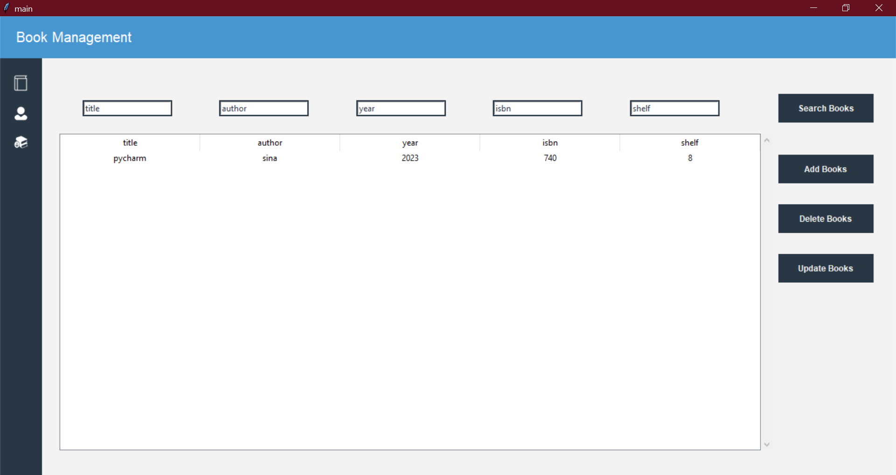

# Library-Management-System
python Library-Management-System - book Management and issue system - 


landing page             |  products management
:-------------------------:|:-------------------------:
  |  


## Create exe file 
use the command below in pycharm terminal to get exe file

```shell
pip install pyinstaller
pyinstaller --onefile -w login.py 
```
